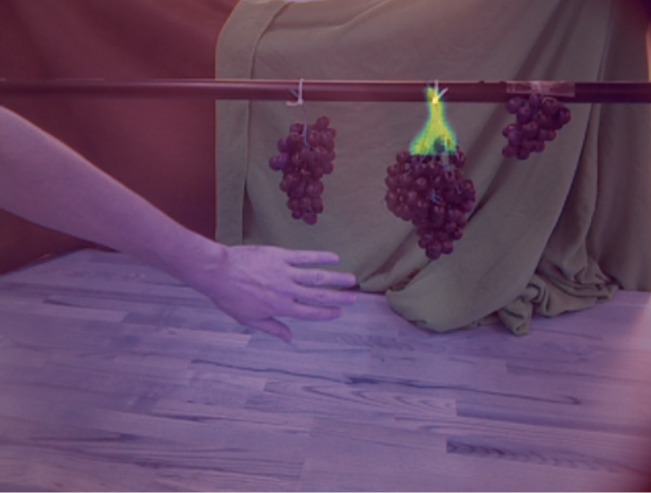
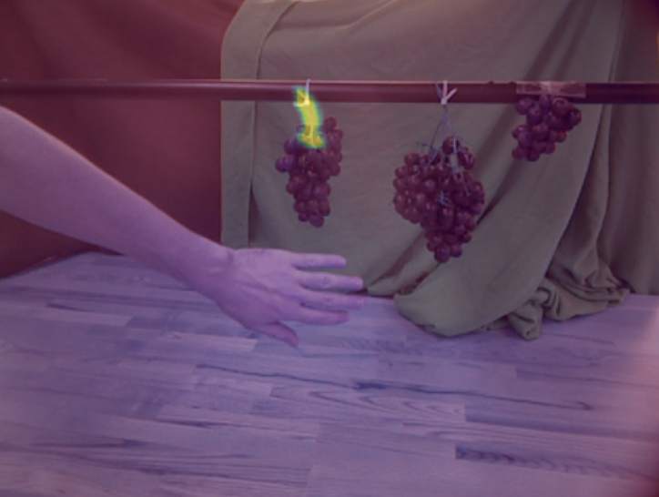

# GrapeJuice: Grape Localization for Automated Harvesting

   
  <em>Fig: Robotic Grape Harvesting on Fetch</em>

 

Hello! Welcome to GrapeJuice, a grape localization pipeline designed for automated harvesting. To run the masking and stem detection scripts, you need the dataset, which is too large to store on a git repo. Email me at *advaithb@umich.edu* for the dataset zip file!

*This project is in progress!* 

## Overview

   
  <em>Fig: GrapeJuice model architecture</em>

 

GrapeJuice proposes a localization system for grape bunches to support robotic harvesting. The main objective is to localize cutting points and estimate the pose of grape bunches to provide waypoints to a robotic manipulator. 

## Features

- Localization of grape bunches
- Estimation of cutting points
- Pose estimation for robotic manipulation
- Generalizable to almost all fruits with labeled data

## Grape Masking

*grape_masking* contains an implementation of a MaskRCNN for grape bunch masking using the WGISD Dataset. We report an average test set IoU of 72% on just 100 training images!

   
  <em>Fig: Predicted Grape Mask Example </em>

 

## Stem Detection

*stem_detection* contains an implementation of a MaskRCNN for stem masking using a custom grape stem dataset. The stem masks will be used to localize the stems for grasping.

  
   
  <em>Fig: Predicted Stem Mask Examples </em>

## Status

This is an ongoing project. We hope to test on the Fetch robot by Summer 2024!

